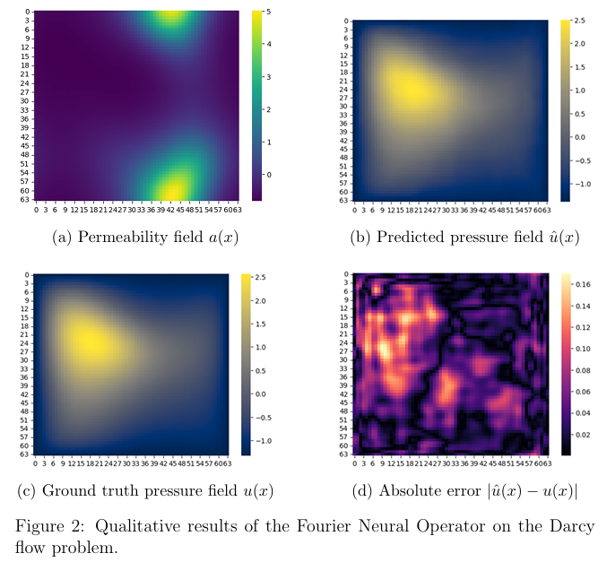
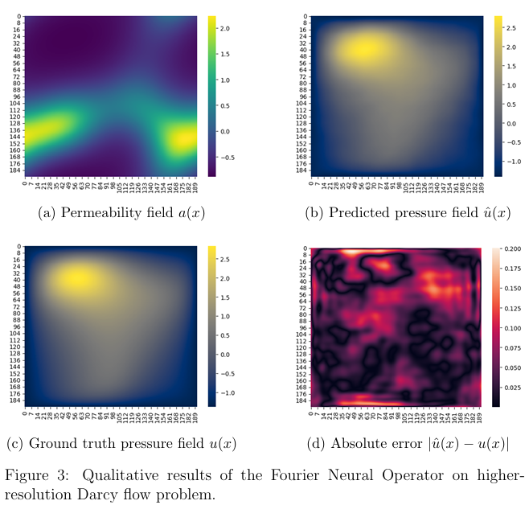

# Fourier Neural Operator for Darcy Flow

This repository implements a **Fourier Neural Operator (FNO)** to solve the 2D steady-state **Darcy Flow equation**. The goal is to learn the *solution operator* that maps heterogeneous permeability fields to pressure solutions, rather than solving the PDE numerically for each instance.

---

## Problem Setup

We consider the Darcy Flow equation on a 2D domain:

[
-\nabla \cdot (a(x,y) \nabla u(x,y)) = f(x,y), \quad u|_{\partial \Omega} = 0
]

where:

* (a(x,y)) is the permeability field
* (u(x,y)) is the pressure field

The task is to learn the operator:

[
\mathcal{G}: a(x,y) \rightarrow u(x,y)
]

---

## Method: Fourier Neural Operator

Instead of learning pointwise mappings, the FNO learns mappings between *functions*. It applies global convolution in Fourier space and truncates to low-frequency modes, which works well for elliptic PDEs like Darcy flow.

**Input per grid point:**

* Permeability (a(x,y))
* Coordinates ((x,y))

**Architecture:**

* MLP lifting layer
* 2 Fourier layers (spectral convolutions)
* Mode truncation: (K_x = K_y = 10)
* MLP decoder

---

## Results (placeholders)

These figures are placeholders and will be replaced with final results.

* 64 x 64 grid prediction
  

* Finer grid (192 x 192) prediction
  

---

## Data & Training

* Permeability fields sampled from a log-normal random field
* Pressure fields generated using a numerical solver
* Grid resolution: 64 × 64 (and later zero-shot test of a 192 x 192 grid)
* Boundary conditions: homogeneous Dirichlet
* Loss: MSE
* Optimizer: Adam

---

---

## Notes

This project focuses on operator learning rather than numerical accuracy at a single resolution. Extensions include resolution generalization, comparisons with CNNs or PINNs, and physics-informed regularization.

---

## Author

Akshay Murthy
